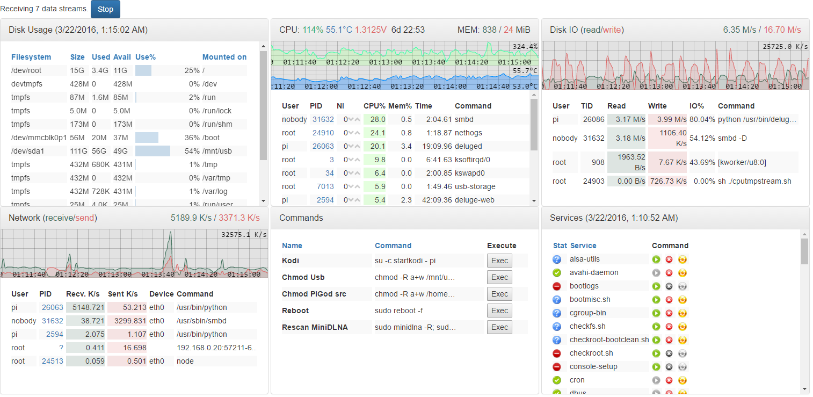

PiGod
=====
A monitoring and controlling tool for the Raspberry Pi built with node.js/express.

This is for my own entertainment, but any ideas/contributions are welcome.



Installation
------------
Clone the git repo (for now).

```git clone https://github.com/Sly1024/pigod.git```

Requirements
---------------
* a [Raspberry Pi](https://www.raspberrypi.org/) with [Raspbian](https://www.raspberrypi.org/downloads/raspbian/) - I have a Raspberry Pi 2 running Raspbian Wheezy (Linux raspi 4.1.13-v7+); but most of the modules should work on any linux machine (see modules)
* Node.js - tested with v4.2.1.

Dependencies
------------
Install runtime dependencies

```npm install``` - in the repo folder.

 * [node.js/express](http://expressjs.com/) - web server 
 * [basic-auth-connect](https://www.npmjs.com/package/basic-auth-connect) - for basic security; planning to do proper HTTPS in the future
 * [riot.js](http://riotjs.com/) - a data-binding micro library; compiling tag files on server and binding to UI on the client
 * [Bootstrap](http://getbootstrap.com/) - for basic styling
 * ~~[jQuery](https://jquery.com/) - because Bootstrap needs it, but I want to get rid of it~~
 * [smoothie charts](http://smoothiecharts.org/) - for displaying timeseries data graphs
 * [ws](https://github.com/websockets/ws) - websocket lib for node

At the moment the client-side libraries are served directly from the `node_modules` folder. I want to build them to a single js file in the future, but if I wait long enough, with HTTP/2.0 it might not be necessary.

Running the server from command line
------------------------------------
```node app.js```

Some modules require root - **do this at your own risk, don't blame me if it causes issues!**

```sudo node app.js```

By default the express server runs at port 3000, so navigate to:

```http://<your_pi's_IP>:3000/ ```

Enter the username/password (default: pi/berry - **you should change it in [app.js](app.js)**), and if everything went OK, you should see the page.

Installing as a service
-----------------------
If you plan to do development, it is useful to have the app restarted automatically when you change any file.<br/>
For that I used [foreverjs](https://www.npmjs.com/package/forever)

```npm install forever -g```

And to automatically start forever as a service, you can use [forever-service](https://www.npmjs.com/package/forever-service/)

```npm install forever-service -g```

I created a script that installs pigod as a service named 'pigodsvc': [install-forever-service.sh](install-forever-service.sh)<br/>
This watches the folder for file changes except the `static` folder which contains the client-side code.

Note: the service also runs as root!

Uninstalling the service:

```forever-service delete pigodsvc```

Background
----------
See [docs/background](docs/background.md).

Architecture
------------
See [docs/architecture](docs/architecture.md).

Modules
-------
See [docs/modules](docs/modules.md).

TODOs
-----
This is not in priority order!
 * [x] Get rid of jQuery - it's too heavy, I only use a small portion; I like micro libraries more.
 * [x] Use the [observable](http://riotjs.com/api/observable/) provided by riot.js as it is present on both server and client. 
 * [x] Factor out a common panel tag and use it in all module tags.
 * [x] Retry connection on client if disconnected.
 * [x] wsPubSubClient and wsPubSubServer has a lot of common code - needs refactoring
 * [ ] Factor out HTML table generation (maybe?) and sorting functionality.
 * [ ] Build (concatenate + minify) all client-side libs (and the compiled riot tags) into a single file.
 * [ ] Implement monitoring modules (CPU) with reading from `/proc`.
 * [ ] Use HTTPS for better security.
 * [ ] Add crosshair on mouseover to smoothie charts.
 * [ ] Add SOW (state of the world) and delta updates to wsPubSub - see [issue #1](https://github.com/Sly1024/pigod/issues/1)
 * [ ] Add ability to manage individual modules on the client - start/stop stream(s), add/remove module.
 * [ ] Persist UI layout.
 * [ ] Documentation
 * [ ] Tests?
 
Browser Support
---------------
The client libraries and the compiled Javascript code should be compatible with all EcmaScript 5 browsers. I have tested it on Chrome and on Android 4 default browser.
