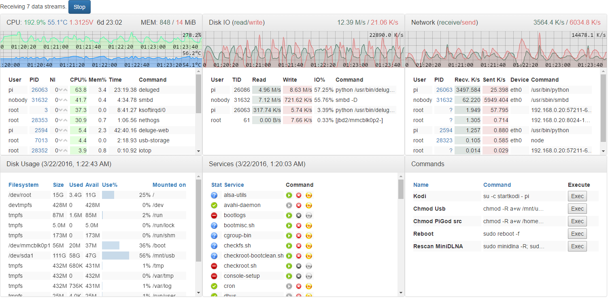

PiGod
=====
A monitoring and controlling tool for the Raspberry Pi built with node.js/express.

This is for my own entertainment, but any ideas/contributions are welcome.



Installation
------------
Clone the git repo (for now).

```git clone https://github.com/Sly1024/pigod.git```

Requirements
---------------
* a [Raspberry Pi](https://www.raspberrypi.org/) with [Raspbian](https://www.raspberrypi.org/downloads/raspbian/) - I have a Raspberry Pi 2 running Raspbian Wheezy (Linux raspi 4.1.13-v7+); but most of the modules should work on any linux machine (see modules)
* Node.js - tested with v4.2.1.

Dependencies
------------
Install runtime dependencies

```npm install``` - in the repo folder.

Running the server from command line
------------------------------------
```node app.js```

Some modules require root - **do this at your own risk, don't blame me if it causes issues!**

```sudo node app.js```

By default the express server runs at port 3000, so navigate to:

```http://<your_pi's_IP>:3000/ ```

Enter the username/password (default: pi/berry - **you should change it in [app.js](app.js)**), and if everything went OK, you should see the page.

Installing as a service
-----------------------
If you plan to do development, it is useful to have the app restarted automatically when you change any file.<br/>
For that I used [foreverjs](https://www.npmjs.com/package/forever)

```npm install forever -g```

And to automatically start forever as a service, you can use [forever-service](https://www.npmjs.com/package/forever-service/)

```npm install forever-service -g```

I created a script that installs pigod as a service named 'pigodsvc': [install-forever-service.sh](install-forever-service.sh)<br/>
This watches the folder for file changes except the `static` folder which contains the client-side code.

Note: the service also runs as root!

Uninstalling the service:

```forever-service delete pigodsvc```

Modules
-------
See [modules](docs/modules.md).

### ... rest is WorkInProgress ...
